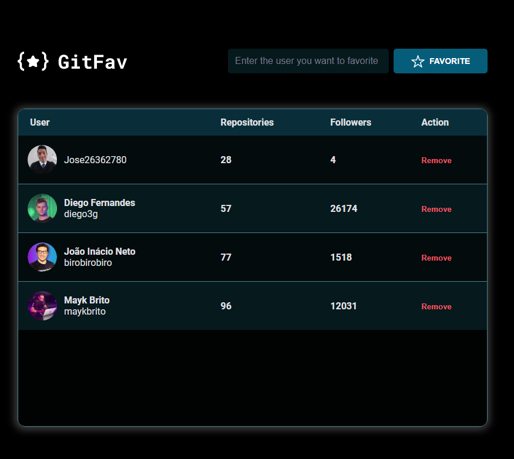

# GivFav

- Projeto desenvolvido durante o stage 06 onde é um site que conecta com a API do Github e você ira salvar o perfil que preferir

> Stage 06 Programa Explorer 

👉🏼[Link do projeto](https://giv-fav-jose26362780.vercel.app/)

#  💻🔧 Tecnologias

- HTML
- Tabelas no HTML
- CSS
- JavaScript
- Assincronismo
- Screen Reader Only
- Imutabilidade
- localStorage
- API do github
- Git
- Git Hub

## Contato 💻

juniorjose1925@gmail.com

https://www.linkedin.com/in/jose-martinez-352032222/
